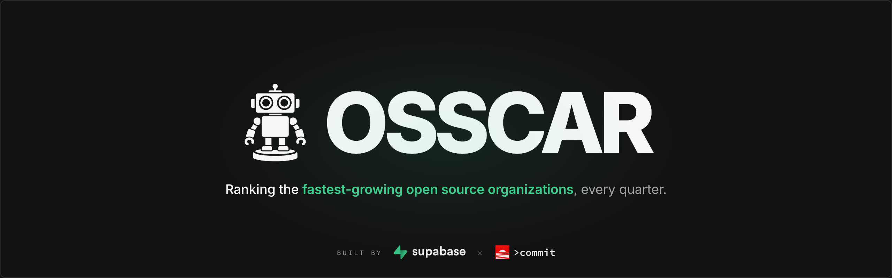

<p align="center">
  
</p>

<p align="center">
  <a href="https://osscar.dev"></a>
  <a href="https://github.com/commitvc/osscar/releases/latest"></a>
  <a href="LICENSE"></a>
</p>

# OSS Growth Index (OSSCAR)

OSSCAR (Open Source Supabase Commit Analytical Ranking) is a quarterly ranking of the fastest-growing open-source GitHub organizations, produced by [Supabase](https://supabase.com) and [>commit](https://commit.fund).

Explore the latest rankings at **[osscar.dev](https://osscar.dev)**.

## Highlights

- **Tens of thousands of organizations ranked each quarter** across three growth signals: GitHub stars, contributors, and package downloads (npm, PyPI, Cargo).
- **Two divisions** — *scaling* and *emerging* — so early-stage projects aren't drowned out by established giants.
- **Reproducible methodology** — log-minmax scoring with an L² norm composite, fully implemented in [`methodology/`](methodology/).

## What is OSSCAR?

The OSS Growth Index tracks growth across GitHub stars, contributors, and package downloads (npm, PyPI, Cargo) for tens of thousands of open-source organizations each quarter. The top 100 organizations in each division are published on the website, and the full dataset is available for download.

**Two divisions**, assigned from each organization's star count at the **start** of the quarter and locked for the rest of it:

- **Scaling** — `stars_start ≥ 1,000`, established organizations with meaningful baselines
- **Emerging** — `stars_start < 1,000`, early-stage organizations where relative growth is more meaningful

## How rankings work

Each of the three growth signals is scored on a [0, 100] scale using log-minmax normalization within each division. The per-signal scores are then combined via the **L² norm** — `√(Σ score_i²)` — into a single composite (max ≈ 173.2). This rewards breadth of growth across multiple signals while still letting standout performance on any single signal stand out.

See the full [methodology documentation](docs/methodology.md) or the [executable scoring pipeline](methodology/).

## Data

**In this repository:** Top 100 rankings per division, one JSON file per division in [`frontend/data/`](frontend/data/). These are the files that power the website.

**Full dataset:** Every tracked organization, published as Parquet assets in [GitHub Releases](../../releases) (raw input data + full ranking output).

Download the latest release with the GitHub CLI:

```bash
# Download all Parquet assets from the most recent release
gh release download --pattern "*.parquet"

# Or pin to a specific quarter, e.g. v2026.Q1
gh release download v2026.Q1 --pattern "*.parquet"
```

See [docs/data/](docs/data/) for schemas and full download / reproduction instructions.

## Documentation

- [Methodology](docs/methodology.md) — how rankings are computed, step by step
- [Data collection](docs/data-collection.md) — how the raw signals are sourced and processed
- [Data schema](docs/data/SCHEMA.md) — column definitions for every published file
- [Scoring pipeline](methodology/) — reproducible Python implementation

## Development

### Frontend

```bash
cd frontend
npm install
npm run dev
```

### Methodology

```bash
cd methodology
pip install -r requirements.txt
python -m pytest              # run tests
python compute_index.py       # compute rankings (requires base data)
```

## Contributing

See [CONTRIBUTING.md](CONTRIBUTING.md). We welcome bug reports, data-quality fixes, frontend improvements, and methodology discussions.

## License

- **Code** (frontend + methodology): [MIT](LICENSE)
- **Data** (JSON files + GitHub Release Parquet assets): [CC BY 4.0](LICENSE-DATA)
